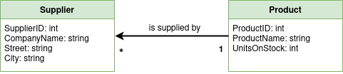
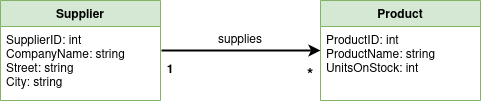
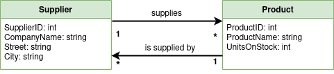
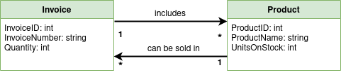
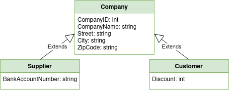

## Exercises

### 1. One-to-Many relationship

- Schema:
    - 
- To do:
    - create relationship from schema
    - from user input add new product
    - create supplier and link it to newly added product
- Reference:
    - [Documentation](https://entityframework.net/one-to-many-relationship#add-reference-navigation-property)
- Solution:
    - [Code](src/1.cs)

### 2. Many-to-One relationship

- Schema:
    - 
- To do:
    - change relationship from exercise 1 to Many-to-One
    - add few products and link them to supplier 
- Reference:
    - [Documentation](https://entityframework.net/one-to-many-relationship#add-collection-navigation-property)
- Solution:
    - [Code](src/2.cs)

### 3. Both ways relationship

- Schema:
    - 
- To do:
    - merge relationships from exercise 1 and 2
    - show how to link supplier to products in each way
- Reference:
    - [Documentation](https://entityframework.net/one-to-many-relationship#add-navigation-properties-in-both-entities)
- Solution:
    - [Code](src/3.cs)

### 4. Many-to-Many relationship

- Schema:
    - 
- To do:
    - create relationship from schema
    - list all products from one invoice
    - show invoices containing chosen product
- Reference:
    - [Documentation](https://entityframework.net/many-to-many-relationship#code-first-conventions)
- Solution:
    - [Code](src/4.cs)

### 5. Inheritance: Table per Hierarchy (TPH)

- Schema:
    - 
- To do:
    - create relationship from schema using TPH strategy
    - fill tables with example data
    - use three different types of query to access your data
- Reference:
    - [Documentation](https://entityframework.net/tph#tph-in-code-first)
- Solution:
    - [Code](src/5.cs)

### 6. Inheritance: Table per Type (TPT)

- To do:
    - modify inheritance strategy from exercise 5 to TPT
- Reference
    - [Documentation](https://entityframework.net/tpt#tpt-in-code-first)
- Solution:
    - [Code](src/6.cs)

## Setup

- Visual Studio
    - It's recommended to use [Visual Studio](https://visualstudio.microsoft.com/) for setting up project.
- Create project
    - To create new project follow [guide](docs/Setup.md).
- Open project
    - Clone repository and switch to branch with solution number.
    - Open Visual Studio and select from menu:
        - `File -> Open -> Project/Solution`
        - Pick `App.sln` from `App` directory of solution

## Run

Open project in Visual Studio and press run button located on the top bar:

- Results:
    - Terminal with results will show up. 
    - Modified database will be available in project location under path: 
        - `bin/Debug/netcoreapp3.1/DatabaseName.db`
        - You can open it using for example [DB Browser for SQLite](https://sqlitebrowser.org/).
- Exception:
    - If `Microsoft.EntityFrameworkCore.DbUpdateException` raises go to:
    - `Solution Explorer -> Right click on database -> Properites -> Copy to Output Directory`
    - Set it to:
        - `Copy if newer` if you want update database in each run of program
        - `Copy always` if you want to clean database before each run of program
- Troubleshooting:
    - Check [setup guide](docs/Setup.md) in case of any other problems.

## Project Information

##### Author

Adrian Niec

##### License

This project is under the MIT [License](LICENSE)
